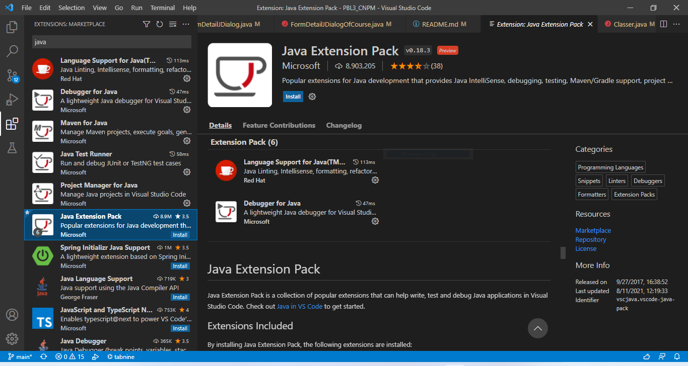

# PBL3_CNPM
### Đề tài: Phần mềm quản lý của một trung tâm đào tạo tin học.
### Danh sách thành viên:
|STT|Tên|Chức vụ|Email|
|-|-|-|-|
|1|Lê Thị Mỹ Hạnh|Giảng viên hướng dẫn|ltmhanh@dut.udn.vn|
|2|Trịnh Công Duy|Doanh nghiệp hướng dẫn|duytc@iotlink.com.vn|
|3|Đồng Minh Phú|Sinh viên (Nhóm trưởng)|dongminhphu846@gmail.com|
|4|Lê Ngọc Duy|Sinh viên|duylengoc1111@gmail.com|
|5|Võ Tấn Hậu|Sinh viên|hauhauhau22446688@gmail.com|
|6|ManyVong Lita|Sinh viên|litamnv2209@gmail.com|
### Thông tin ứng dụng:
  - Ngôn ngữ sử dụng: Java.
  - IDE: Visual Studio Code, Apache Netbeans 12.
  - GUI: JavaSwing.
  - Database: MySQL.
  - Môi trường thực thi: JDK 11.
### Cách cài đặt:
  - B1: Cài đặt các ứng dụng cần thiết: [Visual Studio Code](https://visualstudio.microsoft.com/), [MySQL](https://www.mysql.com/downloads/), [JDK 11](https://docs.aws.amazon.com/corretto/latest/corretto-11-ug/downloads-list.html).
  - B2: Tải Source Code về máy. (Có thể tải dạng file .zip rồi giải nén, hoặc git clone về nếu máy đã cài đặt git).
  - B3: Cấu hình Visual Studio Code:
  
    > Cài "Java Extension Pack" để có thể chạy được project.
  - B4: Cấu hình cơ sở dữ liệu của ứng dụng:
  
    > Lấy file cấu hình [Tại đây](./Documents/SQL/Diagram.mwb). Username và Password để kết nối cơ sở sở liệu là root/root. Nhưng nếu máy bạn cấu hình khác thì thay đổi [Tại đây](./src/com/appdesktop/StudentManagement/DBHelpers/DBHelper.java) để có thể kết nối thành công.
 ### Khởi chạy ứng dụng:
  - Thêm dữ liệu tài khoản admin vào cơ sở dữ liệu:
  
  - Khởi chạy ứng dụng với Visual Studio Code:
  
    > Tìm đến file Main.java theo đường dẫn "src\com\appdesktop\StudentManagement\Main\Main.java".
 ### Một vài chức năng của ứng dụng:
  - Chức năng quản lý sinh viên (bao gồm thêm, sửa, xóa, cập nhật, và tìm kiếm):
  
    > Chức năng quản lý sinh viên: Khi admin thêm 1 sinh viên mới, thì hệ thống sẽ tạo 1 tài khoản mới dành cho sinh viên đó để đăng nhập vào hệ thống. Tương tự, khi sinh viên đó bị xóa khỏi hệ thống thì tài khoản cũng bị xóa theo.
    > Mật khẩu mặc định hệ thống cấp cho mọi tài khoản là: 1234.
  - Chức năng quản lý lớp học:
  
  - Chức năng đăng ký lớp học:
  
  - Chức năng giảng viên cập nhật điểm cho học viên:
  
  - Chức năng xuất báo cáo khóa học, và số lượng học viên đăng ký của lớp học:
  
  - Chức năng xuất danh sách học viên ra file .excel:
  
  ### Hết!
  - Ứng dụng vẫn còn nhiều thiếu sót, nhưng với mục đích chia sẽ đến cộng đồng, mong rằng nó sẽ giúp ích cho bạn 1 phần nào đó!
  - Cảm ơn bạn đã xem đến cuối bài! Nếu bạn thấy hay thì hãy cho nhóm mình 1 sao nhé!😍😍😍
  - Bản demo toàn bộ chức năng của ứng dụng sẽ sớm có [tại đây]()!
  ---
  
  
